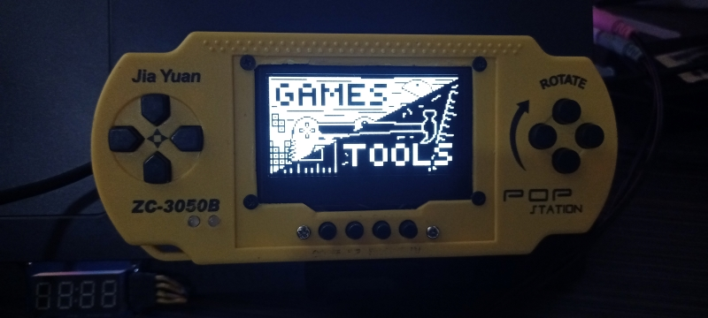

# picon

A handheld gaming console written in MicroPython, inspired by classic brick game handhelds.

The project is developed using the **Raspberry Pi Pico**, but it is designed to run on any **RP2040-based** development
board with compatible hardware. Some parts of the original codebase were based on the
excellent [YouMakeTech/PicoRetroGamingSystem](https://github.com/YouMakeTech/PicoRetroGamingSystem), although the
project has since been largely rewritten.

## Apps

> **Note:** The project is currently undergoing a major refactor.

### Games

- **Snake** — Classic Snake gameplay.
- **Racing Game** — A top-down racing game where you dodge oncoming traffic.
- **Battle City** — A top-down tank game. The name is inspired by the NES game *Battle City*.
- **Sliding Puzzle** — A classic 4×4 sliding tile puzzle.

### Tools

- **Flashlight** — LED flashlight with three modes: Off, On, and Strobe.
- **Keypad Test** — Tests all console buttons.
- ~~**Neopixel Controller** — Toy tool for controlling the onboard NeoPixel LED on the WaveShare RP2040 Zero.~~
- **Notepad** *(WIP)* — A simple text editor.

> **Neopixel Controller:**  
> The project was migrated from the WaveShare RP2040 Zero to the Raspberry Pi Pico during a hardware redesign. The
> Neopixel Controller has not yet been refactored for the new hardware. It can still be used with the original WaveShare
> RP2040 Zero, but support may return only if I revisit that board or add a NeoPixel LED to the current console.

## Getting Started

1. Install MicroPython on your RP2040 board.
2. Copy the project files to the board's root directory.
3. Reboot the board.
4. Enjoy!