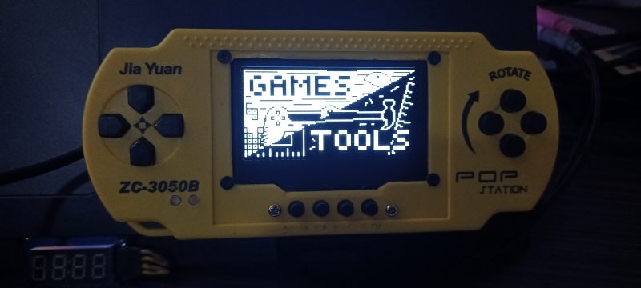

# picon

A handheld gaming console developed using **MicroPython** and the **Raspberry Pi Pico**, designed as a platform for
creating and playing lightweight games and utilities on **RP2040-based** hardware.

Although the project is developed on the **Raspberry Pi Pico**, it is designed to run on any **RP2040-based**
development board with compatible hardware. Parts of the original codebase were initially based on the
excellent [YouMakeTech/PicoRetroGamingSystem](https://github.com/YouMakeTech/PicoRetroGamingSystem), but the project has
since been largely rewritten.

The hardware has also undergone a significant redesign. The console repurposes the shell of an inexpensive brick game
handheld while replacing nearly all of its original electronics. It features a 2.4-inch SSD1309 OLED display, a TP5100
lithium battery charging module in place of the commonly used TP4056, and a Raspberry Pi Pico as the main controller,
replacing the WaveShare RP2040 Zero used during the project's early development.

## Apps

> **Note:** The project is currently undergoing a major refactor.

### Games

- **Snake** — Classic Snake gameplay.
- **Racing Game** — A top-down racing game where you dodge oncoming traffic.
- **Battle City** *(WIP)* — A top-down tank game inspired by the NES title *Battle City*.
- **Sliding Puzzle** — A classic 4×4 sliding tile puzzle.

### Tools

- **Flashlight** — LED flashlight with three modes: Off, On, and Strobe.
- **Keypad Test** — Tests all console buttons.
- ~~**Neopixel Controller** — Toy tool for controlling the onboard NeoPixel LED on the WaveShare RP2040 Zero.~~
- **Notepad** *(WIP)* — A simple text editor.
- **Timer** — A simple countdown timer.

> **Neopixel Controller:**  
> The project was migrated from the WaveShare RP2040 Zero to the Raspberry Pi Pico during a hardware redesign. The
> Neopixel Controller has not been refactored for the new hardware.

## Getting Started

1. Install MicroPython on your RP2040 board.
2. Modify `core/config.py` to match your board's pin configuration and display. **Make sure to read
   the documentation for the [SSD1309 library ](https://github.com/SinaHosseini7/micropython-ssd1309) when configuring
   the display pins.**
3. Copy the project files to the board's root directory.
4. Reboot the board.
5. Enjoy!